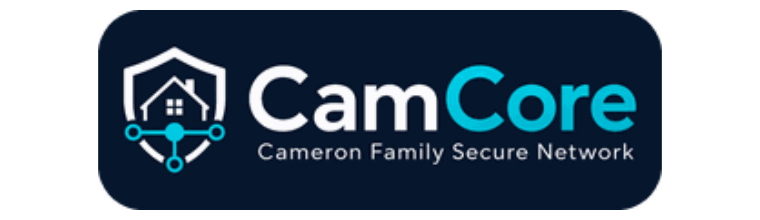

<p align="center">
  
</p>

<p align="center">
  <strong>Cameron-Media Requests</strong><br>
  CamCore-maintained deployment of Seerr for requesting movies and series on Cameron-Media.
</p>

<p align="center">
  <a href="https://requests.camcore.au"><strong>Open Cameron-Media Requests</strong></a>
  ·
  <a href="https://status.camcore.au">CamCore Status</a>
  ·
  <a href="https://camcore.au/help-centre.html">Help Centre</a>
  ·
  <a href="https://github.com/seerr-team/seerr">Upstream Seerr</a>
</p>

## About this repository

This repository is the CamCore-maintained fork of [Seerr](https://github.com/seerr-team/seerr). It preserves the upstream media-request platform while applying CamCore visual identity, operational defaults, email communication standards and a CamCore container build for Cameron-Media Requests.

The application continues to use Seerr's upstream request, discovery, user, notification and administration functionality, including Plex, Sonarr and Radarr integration.

CamCore-specific changes are intentionally kept narrow so upstream fixes can continue to be incorporated with minimal conflict.

## CamCore service identity

| Surface | CamCore identity |
| --- | --- |
| Service | Cameron-Media Requests |
| Public URL | `https://requests.camcore.au` |
| Container | `ghcr.io/camcoreau/seerr` |
| Email sender | `Requests | CamCore Media <help@camcore.au>` |
| Support | `https://camcore.au/support.html` |
| Help Centre | `https://camcore.au/help-centre.html` |
| Service status | `https://status.camcore.au` |
| Time zone | `Australia/Melbourne` |

## CamCore customisation

The downstream layer includes:

- CamCore sign-in branding;
- CamCore desktop and mobile navigation;
- CamCore browser and PWA identity;
- CamCore offline page;
- links to CamCore Home, Help Centre, Service Status, Cameron-Media and Support;
- CamCore-branded request and account emails;
- CamCore GHCR image metadata and publishing workflow;
- CamCore deployment, verification and rollback guidance.

The application title stored in the existing Seerr configuration remains configurable and is not reset by the branded image.

## Email communication standard

Seerr email has been brought into the same communication system used by CamCore Operations support mail.

All Cameron-Media Requests email templates use a common shared layout with:

- the dark CamCore brand header;
- cyan brand divider;
- `CAMCORE MEDIA • REQUESTS` service labelling;
- event/status badges;
- structured light detail panels;
- cyan primary actions;
- CamCore Help Centre, Service Status and support contact details;
- consistent `[CamCore Media] …` subject lines.

Covered messages include request lifecycle updates, media issues, account creation, password reset and test notifications.

The expected sender identity is:

```text
Requests | CamCore Media <help@camcore.au>
```

See [CamCore Deployment](./docs/camcore-deployment.md) for the SMTP and validation checklist.

## Container image

Successful CamCore builds publish:

```text
ghcr.io/camcoreau/seerr:latest
ghcr.io/camcoreau/seerr:camcore
ghcr.io/camcoreau/seerr:develop-<sha>
```

The CamCore production image is built for:

```text
linux/amd64
```

`latest` and `camcore` are only published after the CamCore validation job succeeds. The SHA tag provides an immutable version for rollback and troubleshooting.

## Updating the existing service

Seerr stores persistent application data under:

```text
/app/config
```

Keep the existing host folder mapped to `/app/config` when moving to a new CamCore image. This preserves the database, users, requests, Plex connection, Sonarr and Radarr settings, notification agents and application preferences.

Back up the mapped config folder before an application update.

See [CamCore Deployment](./docs/camcore-deployment.md) for the full deployment, verification and rollback process.

## Example Docker Compose service

```yaml
services:
  seerr:
    image: ghcr.io/camcoreau/seerr:latest
    init: true
    container_name: seerr
    restart: unless-stopped
    environment:
      - TZ=Australia/Melbourne
      - PORT=5055
    ports:
      - "5055:5055"
    volumes:
      - /path/to/existing/seerr/config:/app/config
    healthcheck:
      test: wget --no-verbose --tries=1 --spider http://localhost:5055/api/v1/settings/public || exit 1
      start_period: 20s
      timeout: 3s
      interval: 15s
      retries: 3
```

Replace the example host path with the exact config-folder path already used by the current container.

## Development

Install dependencies:

```sh
pnpm install --frozen-lockfile
```

Start the development environment:

```sh
pnpm dev
```

Run the CamCore validation checks:

```sh
pnpm format:check
pnpm lint
pnpm typecheck
pnpm test
```

Build the production application:

```sh
pnpm build
```

Build the container locally:

```sh
docker build -t camcore-seerr:local .
```

## Keeping the fork current

The CamCore fork should regularly incorporate security fixes and stable changes from `seerr-team/seerr`.

When updating from upstream:

1. review upstream release notes and migration guidance;
2. merge upstream `develop` into the CamCore fork;
3. resolve branding conflicts without removing upstream functionality;
4. pay particular attention to the small set of CamCore-modified UI and email files;
5. allow the CamCore validation workflow to complete;
6. publish the validated CamCore image;
7. deploy while retaining the existing `/app/config` mapping;
8. verify the live service, integrations and email delivery;
9. record material changes in CamCore Operations.

## Support and upstream issues

CamCore-specific deployment, branding, access and operational matters should use [CamCore Support](https://camcore.au/support.html).

For general Seerr application behaviour, first check the upstream project:

- [Seerr source repository](https://github.com/seerr-team/seerr)
- [Seerr documentation](https://docs.seerr.dev)
- [Seerr issue tracker](https://github.com/seerr-team/seerr/issues)
- [Seerr releases](https://github.com/seerr-team/seerr/releases)

## Credits

The underlying Seerr application is developed and maintained by the [Seerr team](https://github.com/seerr-team) and its open-source contributors.

CamCore branding, deployment workflow, email communication layer and operational documentation are maintained for the **CamCore — Cameron Family Secure Network** environment.

CamCore does not claim ownership of the original Seerr project.

## Licence

This repository remains subject to the upstream [MIT Licence](LICENSE).
